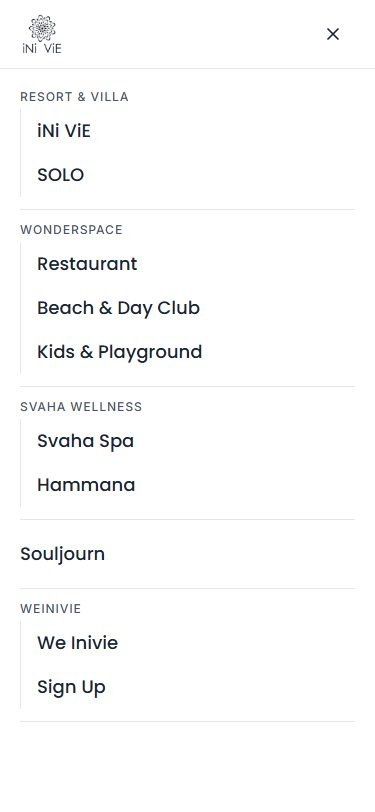

# iNi ViE Hospitality - Homepage Redesign

A redesign of the [inivie.com](https://inivie.com) homepage, built as a decoupled application: **Next.js** for the frontend and **Laravel** as the CMS and REST API, on **MySQL**.

Submitted as a technical test. Deadline 27 August 2026.

---

## Status

| Phase | State |
| --- | --- |
| Planning and specification | **Complete** |
| Laravel CMS and API | **Complete**: public API, admin panel, full CRUD |
| Next.js frontend | **Complete**: homepage, and the revalidation callback that closes the loop |

Remaining work is tracked as [GitHub issues](../../issues), one per pull request, ordered by dependency rather than by date. [docs/PRD.md](./docs/PRD.md) ch. 10 has the shape of that order.

---

## Tech stack

Option 2 from the brief.

| Layer | Technology |
| --- | --- |
| Frontend | Next.js 16 (App Router) + TypeScript |
| Styling | Tailwind CSS 4 |
| CMS and API | Laravel 13, PHP 8.5 |
| Database | MySQL 8.4 LTS |

**Why Option 2.** The live inivie.com is already a decoupled Next.js frontend served by a headless CMS. Option 2 mirrors that architecture, so this project effectively demonstrates replacing that CMS layer with a Laravel API behind a clean contract. The reasoning and the evidence behind it are in [docs/PRD.md](./docs/PRD.md) ch. 2.2.

---

## The dynamic section

The brief asks for one section other than the Hero to be driven by the CMS. This project uses **Featured Properties**, the "Featured property for you" section directly below the Hero.

It is fully managed through the CMS: create, edit, delete, reorder, and publish or unpublish, with image upload. The homepage renders it by calling the Laravel API. Six candidate sections were scored before choosing it; the matrix and the reasoning are in [docs/PRD.md](./docs/PRD.md) ch. 5.

---

## The homepage

Verified at the three widths RS6 names, on the production build with the CMS running. Full page captures are beside each one.

| Mobile, 375px | Tablet, 768px | Desktop, 1440px |
| --- | --- | --- |
| [](./docs/screenshots/home-375.jpg) | [](./docs/screenshots/home-768.jpg) | [](./docs/screenshots/home-1440.jpg) |

Below 1024px the navigation is a drawer, which traps focus, closes on Escape, and hands focus back to the button that opened it.



### What was measured

Lighthouse 13 and axe-core, against `next build && next start` on 24 August 2026. The full record, including what the two misses are and why neither is fixed by different code, is in [docs/TECHNICAL-DESIGN.md](./docs/TECHNICAL-DESIGN.md) ch. 7.4.

| | Target | Measured |
| --- | --- | --- |
| Lighthouse Performance, mobile | at least 90 | **92**, moving a point either way between runs |
| Lighthouse Accessibility | - | **96** |
| Lighthouse Best practices | - | **100** |
| Lighthouse SEO | - | **100** |
| Largest Contentful Paint | under 2.5s measured | **1.8s** measured, 3.3s on Lighthouse's estimate |
| Cumulative Layout Shift | under 0.1 | **0** |
| Total Blocking Time | under 200ms | **20ms** |
| Application JavaScript, gzipped | under 50KB over the framework | **45KB**, of 158KB in total |
| Horizontal scroll from 320px | none | **none**, at seven widths |
| axe serious violations | none, bar one named exception | **one**, and it is the exception |

Two of those targets read differently here than they did when they were written. Measuring the page showed both describing the wrong thing - a paint time that depends on whether Lighthouse measures or estimates, and a byte budget that was really a budget on React - so [docs/PRD.md](./docs/PRD.md) ch. 8.2 carries a dated correction for each.

The axe violation is white text on the brand orange, 2.98 to 1 against AA's 4.5. It is what inivie.com itself ships on its own Search button, and no text colour rescues that fill: the alternatives were built and measured before the deviation was accepted. It is recorded as a **named exception** rather than a relaxed rule, so the next contrast failure still fails. [docs/DESIGN-SYSTEM.md](./docs/DESIGN-SYSTEM.md) ch. 2.2 has the numbers, [docs/PRD.md](./docs/PRD.md) ch. 8.4 the decision.

---

## Documentation

| Document | Contents |
| --- | --- |
| [docs/PRD.md](./docs/PRD.md) | Problem, goals, scope, the dynamic section decision, functional requirements, acceptance criteria, plan, risks |
| [docs/TECHNICAL-DESIGN.md](./docs/TECHNICAL-DESIGN.md) | Architecture, stack decisions, CMS implementation, repository structure, security, testing strategy |
| [docs/DATA-MODEL.md](./docs/DATA-MODEL.md) | Database schema, indexes, domain rules, seed data |
| [docs/API-SPEC.md](./docs/API-SPEC.md) | Endpoint contract, payloads, caching, revalidation, failure behaviour |
| [docs/DESIGN-SYSTEM.md](./docs/DESIGN-SYSTEM.md) | Colour, typography, spacing, motion, breakpoints, component visual specs |

The PRD is the frozen agreement on what is being built. The other four are living documents that change as implementation proceeds.

The original brief PDF is deliberately not committed. It is the client's document rather than project output, and is excluded in `.gitignore`.

---

## Setup

The CMS block below was run from a genuinely fresh clone on 24 August 2026, top to bottom, and every line of it is here because it was needed. The frontend still has to join it before acceptance criterion A15 in the PRD is met.

```bash
cd cms
cp .env.example .env              # nothing else creates it, see below
docker compose up -d --build      # PHP 8.5 and MySQL 8.4
docker compose exec app composer install
docker compose exec app php artisan key:generate
docker compose exec app php artisan migrate --seed
docker compose exec app php artisan storage:link

npm install && npm run build      # on your machine, not in the container
```

**The first line is the one a fresh clone cannot do without.** `.env` is gitignored, which is how requirement S4 keeps credentials out of version control, so only `.env.example` is committed and a clone arrives with no environment file at all. Nothing else in the block creates one. `key:generate` writes the key **into** `.env`, it does not create the file, and with no file to write into it stops the setup dead with `file_get_contents(/app/.env): Failed to open stream` and a non-zero exit. Copy it before `docker compose up` rather than after, so that the credentials MySQL initialises its volume with are the ones in the file.

**That last pair is not optional, and skipping it fails quietly.** Laravel compiles its own CSS and JS with Vite, `cms/public/build/` is gitignored, and the container carries PHP but no Node. Without it the API still answers correctly and `/admin` still returns 200, serving unstyled HTML. The reasoning is in [docs/TECHNICAL-DESIGN.md](./docs/TECHNICAL-DESIGN.md) ch. 2.4.

**`storage:link` is not optional either.** `cms/public/storage` is gitignored, so a fresh clone has no symlink and the `public` disk is not reachable over HTTP. Skipping that line leaves every seeded picture a 403 with its alt text showing, in the CMS and on the homepage alike.

**An edit in the CMS reaches the homepage straight away**, rather than after the 60 second cache window, because Laravel posts a cache invalidation callback to the frontend. That needs the same `REVALIDATE_SECRET` in `cms/.env` and in `web/.env.local`. Both `.env.example` files ship it empty, because a value published in a public repository is not a secret and requirement S4 says none may be in version control: pick any string, put the same one in both files, and restart the two servers. Left empty, the callback stays off and the homepage catches up on its own within a minute, which is the only thing that changes. [docs/API-SPEC.md](./docs/API-SPEC.md) ch. 5.2 has the contract.

The eight seeded properties come with their pictures. They are drawings committed at `cms/database/seeders/images/`, not photographs: this repository is public, and the photography on the live site is licensed stock that may not be redistributed. `migrate --seed` copies them onto the storage disk, so there is nothing to download. [docs/DATA-MODEL.md](./docs/DATA-MODEL.md) ch. 4 has the reasoning.

### Using your own PHP and MySQL

Skip Docker entirely. Two of the things the block above relies on were never commands in it, they were Compose: creating the database with its user, and running the server. Both are yours here, on top of the two addresses in `.env`.

So, once, in your MySQL:

```sql
CREATE DATABASE inivie;
CREATE USER 'inivie'@'localhost' IDENTIFIED BY 'secret';
GRANT ALL PRIVILEGES ON inivie.* TO 'inivie'@'localhost';
```

Those three values are `DB_DATABASE`, `DB_USERNAME` and `DB_PASSWORD` from `.env.example`. Change them there instead if you would rather not have a database called `inivie` on your machine.

Then copy the environment file and edit two addresses in it:

```bash
cd cms
cp .env.example .env
```

`DB_HOST` goes from `mysql` to `127.0.0.1`, and `FRONTEND_INTERNAL_URL` from `http://host.docker.internal:3000` to `http://localhost:3000`. Those two are the only addresses that differ between the paths: inside a container, the frontend running on your machine is not on localhost, and here it is. [docs/TECHNICAL-DESIGN.md](./docs/TECHNICAL-DESIGN.md) ch. 2.4 has the reasoning.

The rest is the Docker block with the prefix dropped, plus the server that Compose was starting:

```bash
composer install
php artisan key:generate
php artisan migrate --seed
php artisan storage:link
npm install && npm run build

php artisan serve                 # http://localhost:8000, as the container did
```

**This path is documented but unverified.** The machine this was built on has no PHP and no MySQL outside Docker, so the steps above are derived from the verified ones rather than executed. The application is built not to care which one you took - no container hostname reaches `config/`, and deleting `cms/docker-compose.yml` leaves a working Laravel application - but that is an argument about the code, not a run, and what Compose does for you around the code is what this section has to make up for.

### Looking at the database

`docker compose up -d` also starts **phpMyAdmin at http://localhost:8080**, signed in with the `inivie` / `secret` pair from `cms/.env`. It is a browser for the database and no part of the application: deleting it from `cms/docker-compose.yml`, or deleting that file outright, leaves Laravel working.

MySQL is published on `127.0.0.1:3306` as well, so any client will do. Set `FORWARD_PMA_PORT` or `FORWARD_DB_PORT` if either port is already taken on your machine.

`docker compose down` keeps the data. `docker compose down -v` deletes the volume with it, and the way back is `migrate --seed`.

### Admin access

The panel is at **http://localhost:8000/admin**.

| Field | Value |
| --- | --- |
| Email | `admin@inivie.com` |
| Password | `password` |

A demo account on a local database, seeded by `AdminUserSeeder` and published here on purpose: a reviewer who cannot sign in cannot review the CMS. `php artisan db:seed` resets it to these values.

---

## Repository layout

```
.
├── docs/     specification, see the table above
├── cms/      Laravel application
└── web/      Next.js application
```

Full structure with file level detail is in [docs/TECHNICAL-DESIGN.md](./docs/TECHNICAL-DESIGN.md) ch. 8.
