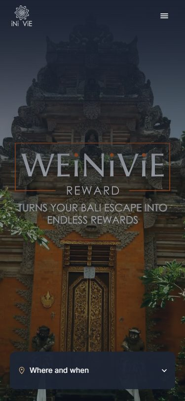
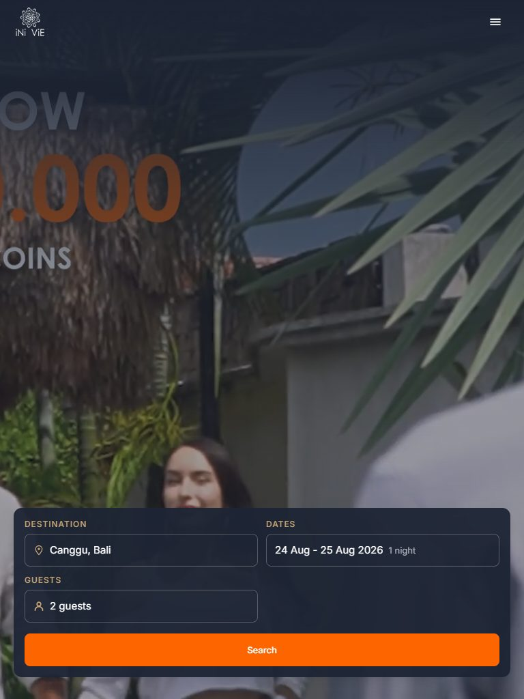
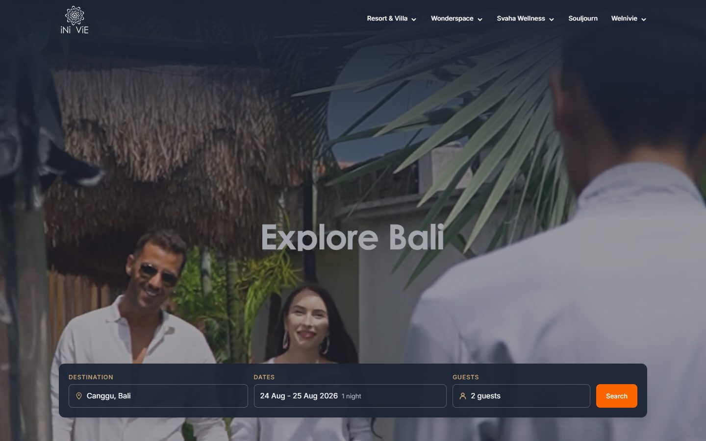

# iNi ViE Hospitality - Homepage Redesign

A redesign of the [inivie.com](https://inivie.com) homepage, built as a decoupled application: **Next.js** for the frontend, **Laravel** as the CMS and REST API, on **MySQL**. Submitted as a technical test.

The CMS-driven section is **Featured Properties**, directly below the Hero: create, edit, delete, reorder, publish or unpublish, with image upload. Everything else on the page is static content.

| Mobile, 375px | Tablet, 768px | Desktop, 1440px |
| --- | --- | --- |
| [](./docs/screenshots/home-375.jpg) | [](./docs/screenshots/home-768.jpg) | [](./docs/screenshots/home-1440.jpg) |

## Stack

| Layer | Technology |
| --- | --- |
| Frontend | Next.js 16 (App Router), TypeScript, Tailwind CSS 4 |
| CMS and API | Laravel 13, PHP 8.5 |
| Database | MySQL 8.4 LTS |

## Setup

Requires **Docker** and **Node 24**, or PHP 8.5, MySQL 8.4 and Node 24 without Docker ([below](#without-docker)). Start the CMS first: the frontend calls it while rendering.

Both applications were set up from a fresh clone on 24 August 2026, and the record of that run is in [docs/TECHNICAL-DESIGN.md](./docs/TECHNICAL-DESIGN.md) ch. 2.4.

### 1. CMS, on http://localhost:8000

```bash
cd cms
cp .env.example .env              # gitignored, nothing else creates it
docker compose up -d --build      # PHP 8.5, MySQL 8.4, phpMyAdmin on :8080
docker compose exec app composer install
docker compose exec app php artisan key:generate
docker compose exec app php artisan migrate --seed
docker compose exec app php artisan storage:link

npm install && npm run build      # on your machine: the image carries no Node
```

Three of those lines fail quietly or loudly if skipped, and each has a reason:

- **`cp .env.example .env`** comes first because `key:generate` writes into that file rather than creating it, and stops the setup with `Failed to open stream` when it is missing. Copying it before `docker compose up` also gives MySQL the credentials it initialises its volume with.
- **`npm run build`** compiles the admin panel's CSS and JS into the gitignored `cms/public/build/`. Without it the API still answers correctly and `/admin` still returns 200, serving unstyled HTML.
- **`storage:link`** publishes the `public` disk. Without it every seeded picture is a 403, in the CMS and on the homepage alike.

The eight seeded properties arrive with their images, copied onto the disk by `migrate --seed`. They are drawings rather than photographs, because the live site's photography is licensed stock that a public repository may not redistribute ([docs/DATA-MODEL.md](./docs/DATA-MODEL.md) ch. 4).

`docker compose down` keeps the data, `down -v` deletes it, and `migrate --seed` is the way back. Set `FORWARD_DB_PORT` or `FORWARD_PMA_PORT` if 3306 or 8080 is taken.

### 2. Frontend, on http://localhost:3000

```bash
cd web
cp .env.example .env.local        # gitignored, needs no editing
npm install
npm run dev
```

Without `.env.local` every command still succeeds and the homepage still returns 200, with **Featured Properties rendering its heading and no cards**: the section degrading rather than taking the page down, which is requirement F5. The only sign is one line in the build output, `[api/properties] CMS_API_URL is not set, so there is no API to call`.

The copied file needs no edits. `REVALIDATE_SECRET` is the only line worth touching: put the same string here and in `cms/.env` and a CMS edit reaches the homepage immediately instead of within the 60 second cache window. Left empty the callback stays off, which costs a minute and nothing else ([docs/API-SPEC.md](./docs/API-SPEC.md) ch. 5.2).

### 3. Admin panel, on http://localhost:8000/admin

| Field | Value |
| --- | --- |
| Email | `admin@inivie.com` |
| Password | `password` |

A demo account on a local database, published here on purpose: a reviewer who cannot sign in cannot review the CMS. `php artisan db:seed` resets it.

### Without Docker

Compose does two things that are not commands in the block above: it creates the database with its user, and it runs the server. Both are yours here.

```sql
CREATE DATABASE inivie;
CREATE USER 'inivie'@'localhost' IDENTIFIED BY 'secret';
GRANT ALL PRIVILEGES ON inivie.* TO 'inivie'@'localhost';
```

Those three values are `DB_DATABASE`, `DB_USERNAME` and `DB_PASSWORD` in `.env.example`. Copy that file to `.env`, then change the two addresses that differ between the paths: `DB_HOST` from `mysql` to `127.0.0.1`, and `FRONTEND_INTERNAL_URL` from `http://host.docker.internal:3000` to `http://localhost:3000`. Nothing else differs.

```bash
composer install
php artisan key:generate
php artisan migrate --seed
php artisan storage:link
npm install && npm run build

php artisan serve                 # http://localhost:8000, as the container did
```

**On Windows, PHP arrives with its extensions switched off.** A fresh install has no `php.ini`: copy `php.ini-development` beside it as `php.ini`, then uncomment `extension_dir = "ext"` and the lines for `curl`, `fileinfo`, `mbstring`, `openssl`, `pdo_mysql` and `zip`, plus `pdo_sqlite` to run the test suite. That is the entire difference between the two paths in practice.

## Checks

```bash
cd cms && composer test && vendor/bin/pint --test    # 192 Pest tests
cd web && npm run lint && npm run typecheck && npm test && npm run format:check

cd web && npx playwright install chromium            # one download, once
cd web && npm run test:e2e                           # 7 Playwright tests
```

The end to end suite needs neither the CMS nor a database. It builds the frontend three times against a stub, once per state the API can be in, because the homepage is prerendered and a build is therefore where that state is decided ([docs/TECHNICAL-DESIGN.md](./docs/TECHNICAL-DESIGN.md) ch. 9.1). That is what lets it prove requirement A14: the homepage still renders, cleanly and whole, with Laravel stopped. It takes about a minute, most of it the three builds.

Lighthouse on the production build, `npm run build && npm start`, measured 24 August 2026: **92** performance on mobile, **96** accessibility, **100** best practices, **100** SEO, CLS 0. The full record, including the one accepted contrast exception, is in [docs/TECHNICAL-DESIGN.md](./docs/TECHNICAL-DESIGN.md) ch. 7.4.

## Documentation

```
.
├── docs/     specification, see below
├── cms/      Laravel application
└── web/      Next.js application
```

| Document | Contents |
| --- | --- |
| [docs/PRD.md](./docs/PRD.md) | Problem, goals, scope, the dynamic section decision, requirements, acceptance criteria, plan, risks |
| [docs/TECHNICAL-DESIGN.md](./docs/TECHNICAL-DESIGN.md) | Architecture, stack decisions, CMS implementation, repository structure, security, testing |
| [docs/DATA-MODEL.md](./docs/DATA-MODEL.md) | Database schema, indexes, domain rules, seed data |
| [docs/API-SPEC.md](./docs/API-SPEC.md) | Endpoint contract, payloads, caching, revalidation, failure behaviour |
| [docs/DESIGN-SYSTEM.md](./docs/DESIGN-SYSTEM.md) | Colour, typography, spacing, motion, breakpoints, component visual specs |

The PRD is the frozen agreement on what is being built. The other four change as implementation proceeds. Remaining work is tracked as [GitHub issues](../../issues).
